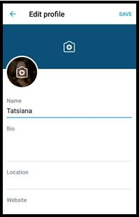
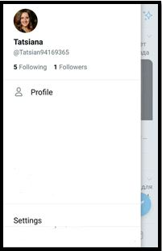
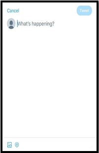
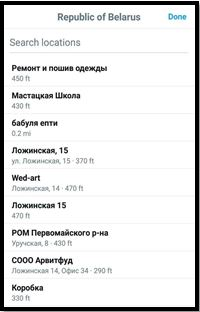
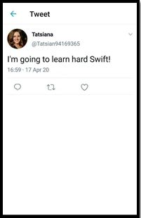
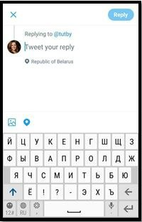
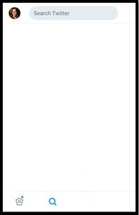
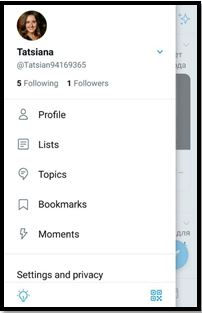
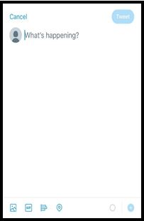
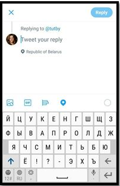

  The document contains a draft list of screens and functionality, which will be used in BulbaTalks app. 
 The screens were used from the Twitter app and  most of  them were modified. The original versions of the screens are given at the end of the document. 

| Launch                         |  |
| :----------------------        | :-----|
| | TBD: the team is deciding which logo to create. Start-up screen displaying a BulbaTalks logo.|
| **Authorization**              |  |
|            | Allows an authorized Twitter User to access to his private account.|
| **Profile**                    |  |
|         | Contains information about User e.g.:  -	account name;  -	@name (an unique identification of account); -	day of registration in app. User has an access to thumbnail presentation of all his Tweets and can open the desired Tweet. Also, the User could add a new Tweet by tapping on the button «Tweet» From here User can navigate to the settings of his Profile and to the list of Following/Followers.|
| **Edit profile**               |  |
|            | Allows to load a header/profile photo and to change personal information.|
| **Following/Followers**       |  |
|       | Displays the list of Following/Followers.  In these screens User could follow/unfollow selected account by tapping on the button «Following».|
| **Follow profile**             |  |
|| Contains personal information of  Twitter User (the same information like in the Profile screen).  Allows follow/unfollow this account by tapping on the button «Following».|
| **List of tweets**             |  |
|            | Displays a list of Tweets from accounts User has chosen to follow on. In this screen User could:  1.	Scroll Tweets.  2.	Comment, retweet and like a Tweet.  3.	Add a new Tweet by tapping on the button «Tweet».  4.	Go up the list by clicking on the Home icon.  5.	Go to the Search screen.  6.	Open the sidebar menu by clicking on the User’s  photo or by swiping the screen from left to right.|
| **Sidebar menu**               |  |
|         | From here User can navigate to the Profile, to the list of Following/Followers and to the settings of his account.|
| **Tweet**                      |  |
|      | Allows to create a new Tweet by entering a message (up to 280 characters) and to add an image or a location. |
| **Location**                   |  |
|      | Displays the current location of  User and allows to search a required address.|
| **Selected tweet**             |  |
|           | Displays selected Tweet. User could comment, retweet and like a selected Tweet.|
| **Comment**                    |  |
|         | Allows to comment a selected Tweet and to add an image or a location .|
| **Search**                     |  |
|          | Contains the search box at the top of the page in which the User could enter his search query. Results will show a combination of Tweets, accounts. From here the User can navigate to the Twitter timeline.|
| **Settings**                   |  |
|                                | TBD: the team is thinking about a screen layout. Allows to change a language and  to log out of app.|

The original versions of the screens:

| Profile          | Following           | Follow profile         | List of tweets |
| :--------------- | :---------------    | :----------------------| :--------------|
| |  |  |  |
|**Sidebar menu**  | **Tweet**| **Selected tweet** | **Comment** |
| |  |  |  |
|**Search**        |                     |                        |                |
| | | | |
